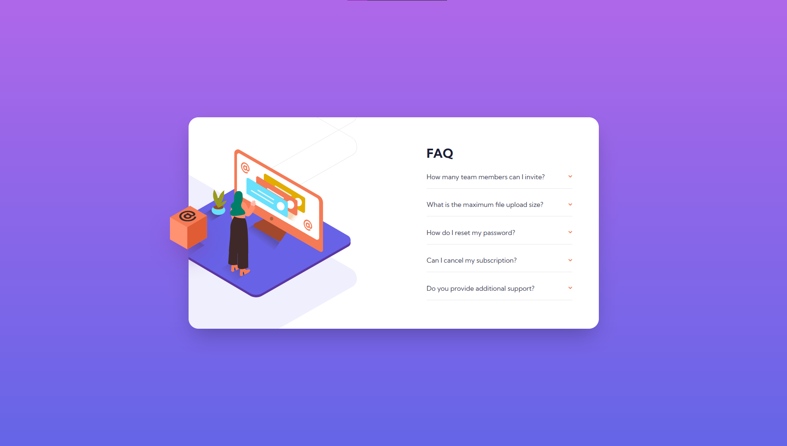

# Frontend Mentor - FAQ accordion card solution

This is a solution to the [FAQ accordion card challenge on Frontend Mentor](https://www.frontendmentor.io/challenges/faq-accordion-card-XlyjD0Oam). Frontend Mentor challenges help you improve your coding skills by building realistic projects.

## Table of contents

- [Overview](#overview)
  - [The challenge](#the-challenge)
  - [Screenshot](#screenshot)
  - [Built with](#built-with)
  - [Links](#links)
- [Author](#author)

## Overview

This one is my favorite project so far, I learned alot in terms of layout. Although right now the dropdown is not as smooth, but I still had to finish this to be consistent with my goal (which is completing atleast one frontend mentor challenge everyday.).

### The challenge

Users should be able to:

- View the optimal layout for the interface depending on their device's screen size
- See hover and focus states for all interactive elements on the page

### Screenshot

### Links

Site Link: https://faq-accordion-card-main-kohis-solution.vercel.app
### Built with

- Semantic HTML5 markup
- Grid
- Flexbox
- CSS Grid
- TailwindCSS
- JavaScript

# Author

- Frontend Mentor - [@kohicha](https://www.frontendmentor.io/profile/kohicha)
- Twitter - [@eepykohi](https://twitter.com/eepykohi)
  z
